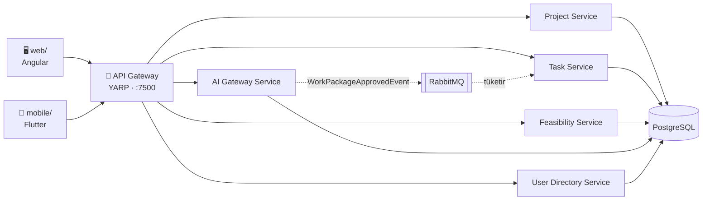

# 📊 Proje Yönetimi Modülü

<p>
  
  
  
  
  
  
  
</p>

Bir web istemcisi, bir mobil istemci ve mikroservis mimarisinde bir .NET backend'ten oluşan bir
**proje yönetimi platformu** (monorepo). Proje/görev/fizibilite takibi ve RAG tabanlı bir AI
asistanı ile iş paketi önerisi sunar.

> 🔒 **Bu repo hiçbir gerçek şirket verisi içermez.** Gerçek API adresleri, sunucu bilgileri ve
> anahtarlar `.env` dosyalarında tutulur; bu dosyalar `.gitignore` ile hariç tutulmuştur ve **repoya
> hiçbir zaman commit edilmez**. Repoda yalnızca `*.env.example` şablonları vardır — kendi ortamınız
> için bunlardan kopyalayıp doldurmanız gerekir (bkz. [Ortam Değişkenleri](#-ortam-değişkenleri)).

---

## İçindekiler

- [Genel Bakış](#-genel-bakış)
- [Proje Yapısı](#-proje-yapısı)
- [Gereksinimler](#-gereksinimler)
- [Kurulum ve Çalıştırma](#-kurulum-ve-çalıştırma)
- [Test Giriş Bilgileri](#-test-giriş-bilgileri)
- [Ortam Değişkenleri](#-ortam-değişkenleri)
- [Branching ve Çalışma Akışı](#-branching-ve-çalışma-akışı)
- [Testler](#-testler)
- [Lisans](#-lisans)

## 🧭 Genel Bakış



Web ve mobil istemciler backend'e **sadece HTTP üzerinden** (API Gateway, port 7500) bağlanır —
üçü de birbirinden bağımsız geliştirilip çalıştırılabilir. Mimari, tasarım kararları ve gerekçeleri
için [backend/README.md](backend/README.md)'ye bakın.

## 📂 Proje Yapısı

```
.
├── web/                  # Angular 21 web istemcisi      → web/README.md
├── mobile/               # Flutter mobil istemci          → mobile/README.md
│                           (Android · iOS · Windows · macOS · Linux · Web)
├── backend/              # 5 .NET mikroservisi + Gateway  → backend/README.md
├── docs/                 # Tasarım brief'leri
└── README.md             # bu dosya
```

| Klasör | Teknoloji | Detay |
|---|---|---|
| [`web/`](web/) | Angular 21 (standalone) | [web/README.md](web/README.md) |
| [`mobile/`](mobile/) | Flutter / Dart | [mobile/README.md](mobile/README.md) |
| [`backend/`](backend/) | .NET 10, YARP, EF Core, MassTransit | [backend/README.md](backend/README.md) |

## ⚙️ Gereksinimler

| Araç | Sürüm | Nerede gerekir |
|---|---|---|
| [Node.js](https://nodejs.org/) | 22+ | `web/` |
| [Flutter SDK](https://flutter.dev/) | stable, Dart `^3.12` | `mobile/` |
| [.NET SDK](https://dotnet.microsoft.com/) | 10 | `backend/` (Docker'sız çalıştırma/derleme) |
| [Docker Desktop](https://www.docker.com/products/docker-desktop/) | — | `backend/` yığını ve/veya `web/` prod image'i |

## 🚀 Kurulum ve Çalıştırma

Her alt proje kendi README'sinde detaylandırılır; kısaca, üç ayrı terminalde:

```bash
# 1) Backend
cd backend
cp .env.example .env      # RAG_BASE_URL / RAG_API_KEY / GATEWAY_PORT değerlerini doldurun
docker compose up -d --build   # Gateway: http://localhost:7500/health

# 2) Web
cd web
npm install
npm start                 # http://localhost:4300

# 3) Mobil
cd mobile
cp .env.example .env       # API_BASE_URL'i backend gateway adresine göre ayarlayın
flutter pub get
flutter run
```

## 🔑 Test Giriş Bilgileri

Backend ilk ayağa kalkışta (`Database.Migrate()`) aşağıdaki hesapları otomatik seed eder — **sadece
yerel geliştirme/deneme için**, gerçek bir kimlik sağlayıcı değildir (bkz.
[backend/README.md](backend/README.md#önemli-tasarım-kararları-ve-gerekçeleri)). Hem web hem mobil
istemci aynı backend'e bağlandığı için ikisinde de geçerlidir:

| Rol | E-posta / Kullanıcı Adı | Şifre |
|---|---|---|
| Admin | `admin` | `admin` |
| Proje Yöneticisi | `mustafa.altekin@example.com` | `sifre123` |

Diğer tüm seed çalışanları (`Member` rolü) da aynı test şifresini (`sifre123`) kullanır. **Seed
verideki tüm ad ve e-posta adresleri kurgusaldır** (`@example.com` altında) — herhangi bir gerçek
kişiye veya kuruma ait değildir.

> Bu bir üretim kimlik doğrulama sistemi değildir: `Auth:Mode=Dev` ile yerel bir simetrik anahtarla
> imzalanmış JWT üretilir. Gerçek bir dağıtımda `Auth:Mode=ExternalOidc` + kurumsal bir OIDC sağlayıcı
> (Azure AD/Entra, Keycloak vb.) kullanılması gerekir — bkz. backend README'deki tasarım kararları.

## 🌱 Ortam Değişkenleri

Hiçbir `.env` dosyası bu repoya dahil edilmez — her ikisi de `.gitignore` ile hariç tutulur ve
sadece şablonları (`*.env.example`) commit edilir:

| Şablon | Gerçek dosya (commit edilmez) | Değişken | Açıklama |
|---|---|---|---|
| [`backend/.env.example`](backend/.env.example) | `backend/.env` | `RAG_BASE_URL` | RAG servisinin (RunPod) o anki proxy adresi |
| | | `RAG_API_KEY` | RAG servisi API key bekliyorsa doldurulur |
| | | `GATEWAY_PORT` | API Gateway portu (varsayılan `7500`) |
| [`mobile/.env.example`](mobile/.env.example) | `mobile/.env` | `API_BASE_URL` | Backend REST API'nin kök adresi |

`web/` için ayrı bir `.env` yoktur — API adresi tarayıcının o an açık olduğu adresten
(`window.location.hostname:7500`) otomatik türetilir.

## 🌿 Branching ve Çalışma Akışı

- **`main`** — tek kalıcı branch. Her zaman deploy edilebilir durumda tutulur.
- Geliştirme, alan bazlı kısa ömürlü branch'lerde yapılır ve tamamlandığında **Pull Request**
  üzerinden `main`'e merge edilir:
  - `feature/<alan>-<konu>` — örn. `feature/mobile-login`, `feature/web-dashboard`,
    `feature/project-create`
  - `fix/<alan>-<konu>` — örn. `fix/mobile-login-error`, `fix/web-responsive`
- `web`/`mobile` adında **kalıcı** branch yoktur — ayrım tamamen klasör bazlıdır (`web/`, `mobile/`,
  `backend/`); branch adındaki `web`/`mobile` öneki sadece hangi alanda çalışıldığını belirtir.

## ✅ Testler

```bash
cd backend && dotnet test Ozdilek.PM.slnx
cd web && npm test
cd mobile && flutter test
```

## 📄 Lisans

Bu proje kurumsal/özel kullanım için geliştirilmiştir; açık kaynak lisansı ile
dağıtılmamaktadır. Tüm hakları saklıdır. Bu tutum `web/`, `mobile/` ve `backend/` için ortaktır.
